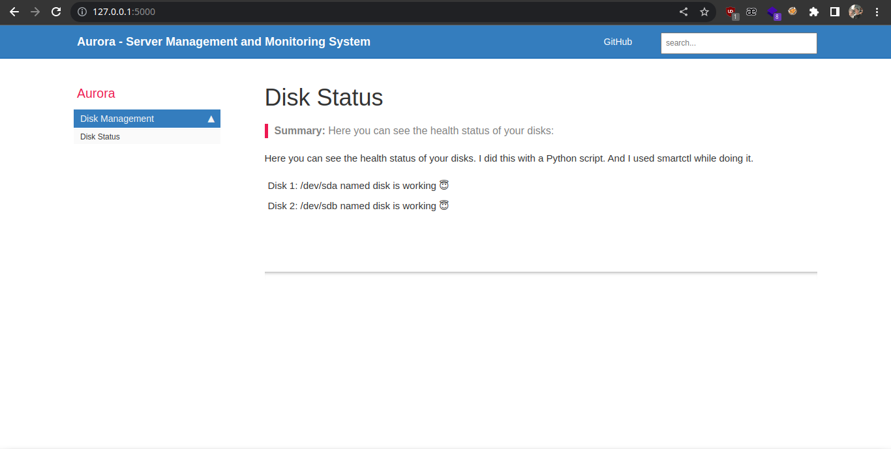

# What is Aurora?
Aurora is a server management and monitoring system that is currently under construction. For now, you can only see if the disk is healthy or not. However, I will develop it to do management or monitoring for the entire system.

Also, I am currently developing a disk management library. If you want to use this library, you will need to use a Python and Linux-based system.



# Which Used to Technologies for This Project?
I use Flask, various Linux software (for example, smartctl), and Subprocess to develop this project.

NOTE: I will also add all the libraries and tools that I will use in the future to this readme.

# Requements
To be able to run this project, you only need to download the Flask library and the smartmontools tool.

### install for requements:
```
cd aurora
chmod 700 req.sh
./req.sh
```

### Manual installation:

```
pip install flask
```
### smartmontools installations:
Debian:
```
sudo apt install smartmontools
```
Arch:
```
yay -S smartmontools or sudo pacman -S smartmontools
```
Fedora:
```
yum install smartmontools or dnf install smartmontools
```
